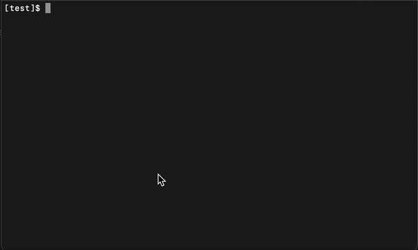

# Code Challenge

This program takes two command-line arguments (one for cart and one for list of base prices) and outputs the total price for the cart.

## Assumptions
As per brief 
* no need to test input files confirm with their schemas 
* no need to test if they conform with each other


## Running the application
Upon unzipping the file run the below command to download all dependencies

```yarn install```


Run the below command to run the application against a file of your choice. 

```yarn start ${filename for cart} ${filename for base prices}```
</hr>


## Running the tests

```yarn test```
</hr>

